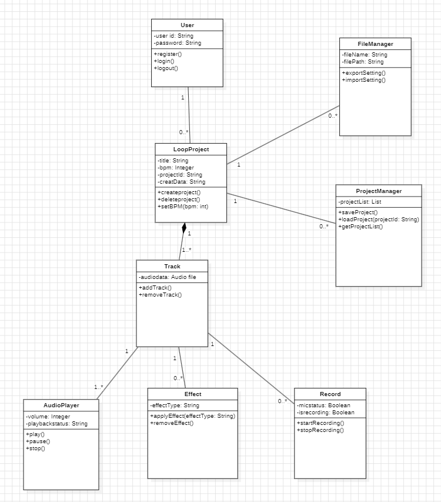

아래 그림은 시스템은 Class Diagram을 표현한 그림이다.

# User Class

해당 클래스는 시스템을 사용하는 사용자의 정보를 관리하는 클래스이다. 회원가입, 로그인 및 로그아웃 기능을 제공하며, 사용자가 생성한 루프 프로젝트와 연결된다. 사용자의 계정 정보는 userId, userName, password, email 속성으로 관리된다.

register() : 새로운 사용자 정보를 입력받아 계정을 생성하는 메소드이다.
login() : 사용자가 입력한 아이디와 비밀번호를 확인하여 시스템 로그인을 수행하는 메소드이다.
logout() : 현재 로그인된 사용자의 세션을 종료하는 메소드이다.
---------------------------------------------------------------------------------------------------
# LoopProject Class

해당 클래스는 사용자가 생성하는 루프 프로젝트를 관리하는 핵심 클래스이다. 프로젝트 제목, BPM 정보, 생성 날짜 등을 저장하며 프로젝트 생성 및 삭제 기능을 제공한다. 또한 하나 이상의 Track 객체를 포함하여 하나의 루프 프로젝트를 구성한다.

createProject() : 새로운 루프 프로젝트를 생성하는 메소드이다.
deleteProject() : 선택한 프로젝트를 삭제하는 메소드이다.
setBPM(bpm : int) : 사용자가 입력한 BPM 값을 프로젝트에 적용하는 메소드이다.
---------------------------------------------------------------------------------------------------
# Track Class

해당 클래스는 루프 프로젝트를 구성하는 개별 오디오 트랙을 관리하는 클래스이다. 녹음된 오디오 데이터와 재생 시간을 저장하며, 하나의 프로젝트에 여러 개의 트랙이 포함될 수 있다.

addTrack() : 새롭게 녹음된 오디오 데이터를 프로젝트에 추가하는 메소드이다.
removeTrack() : 선택한 트랙을 프로젝트에서 삭제하는 메소드이다.
---------------------------------------------------------------------------------------------------
# Recorder Class

해당 클래스는 사용자의 마이크 입력을 처리하고 오디오 녹음을 수행하는 클래스이다. 사용자가 루프를 생성하기 위해 마이크를 활성화하면 녹음을 시작하고, 녹음 종료 시 Track 객체를 생성한다.

startRecording() : 마이크 입력을 활성화하고 녹음을 시작하는 메소드이다.
stopRecording() : 현재 진행 중인 녹음을 종료하고 오디오 데이터를 저장하는 메소드이다.
---------------------------------------------------------------------------------------------------
# AudioPlayer Class

해당 클래스는 저장된 오디오 트랙과 루프를 재생하는 클래스이다. 사용자가 생성한 루프의 재생, 정지 및 일시정지 기능을 제공한다.

play() : 선택한 트랙 또는 루프를 재생하는 메소드이다.
pause() : 현재 재생 중인 오디오를 일시정지하는 메소드이다.
stop() : 현재 재생 중인 오디오를 정지하는 메소드이다.
---------------------------------------------------------------------------------------------------
# Effect Class

해당 클래스는 사용자가 생성한 오디오 트랙에 효과를 적용하는 클래스이다. 리버브(Reverb), 에코(Echo), EQ 등의 효과를 적용하여 사운드를 변경할 수 있다.

applyEffect(effectType : String) : 선택한 효과를 트랙에 적용하는 메소드이다.
removeEffect() : 현재 적용된 효과를 제거하는 메소드이다.
---------------------------------------------------------------------------------------------------
# ProjectManager Class

해당 클래스는 루프 프로젝트의 저장 및 불러오기 기능을 담당하는 클래스이다. 사용자가 생성한 프로젝트를 관리하고 이전 작업을 다시 불러올 수 있도록 지원한다.

saveProject() : 현재 프로젝트를 저장하는 메소드이다.
loadProject(projectId : String) : 저장된 프로젝트를 불러오는 메소드이다.
getProjectList() : 사용자가 저장한 프로젝트 목록을 반환하는 메소드이다.
---------------------------------------------------------------------------------------------------
# FileManager Class

해당 클래스는 루프 프로젝트의 설정 파일을 관리하는 클래스이다. BPM, 트랙 구성, 효과 설정 등의 정보를 파일 형태로 저장하거나 불러올 수 있다.

exportSetting() : 현재 프로젝트의 설정 정보를 파일로 저장하는 메소드이다.
importSetting() : 설정 파일을 업로드하여 프로젝트 정보를 불러오는 메소드이다.
---------------------------------------------------------------------------------------------------