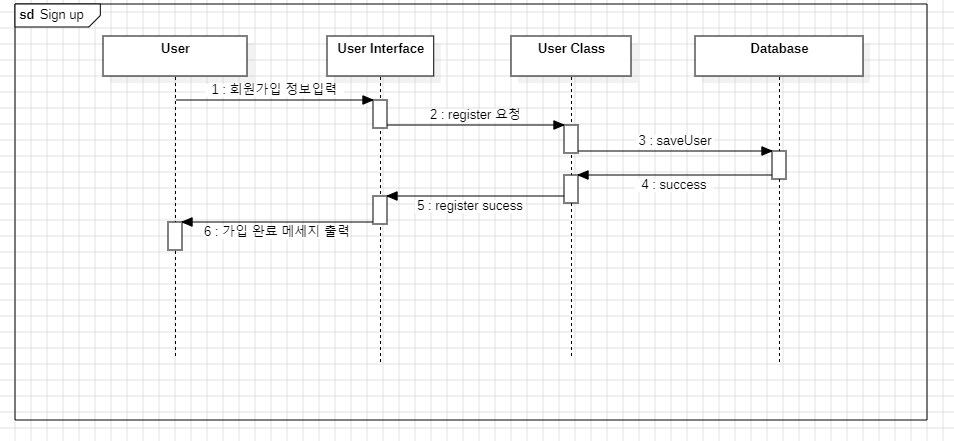
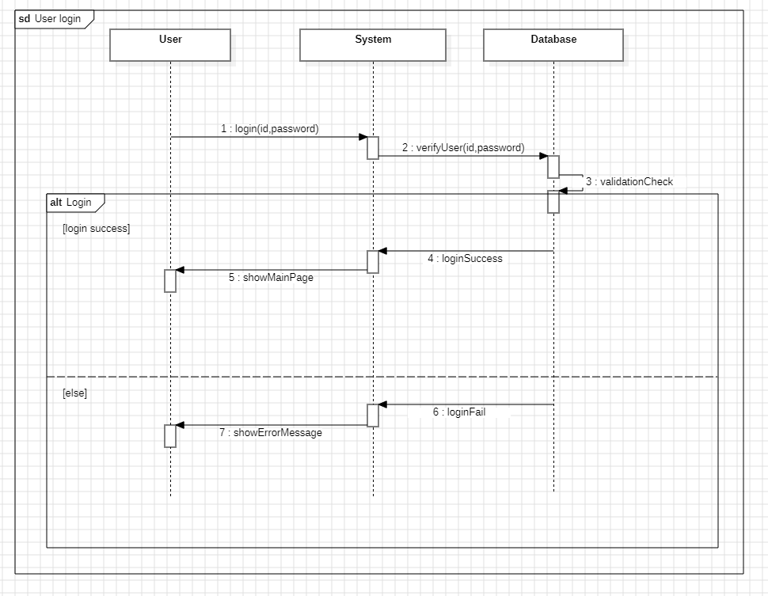
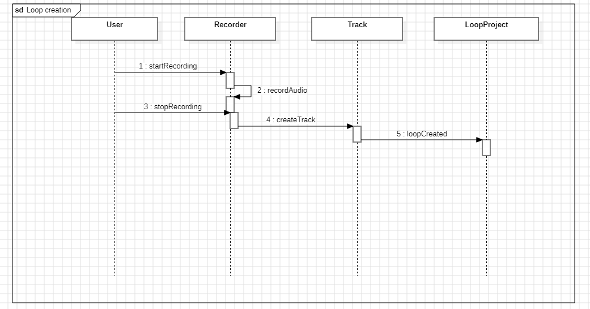
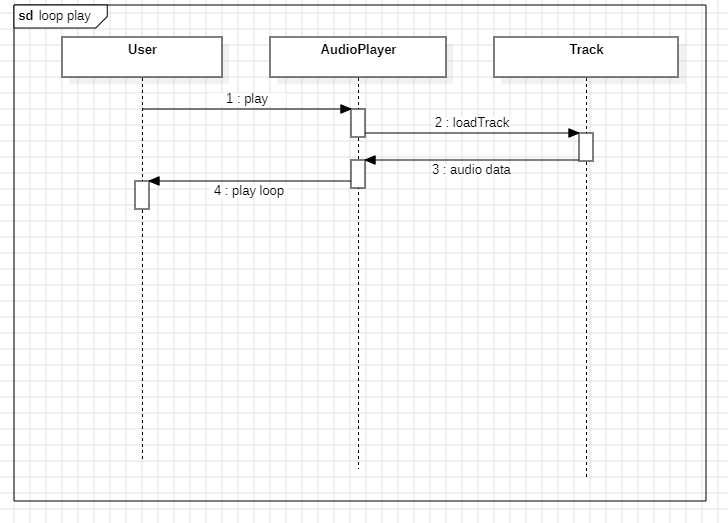
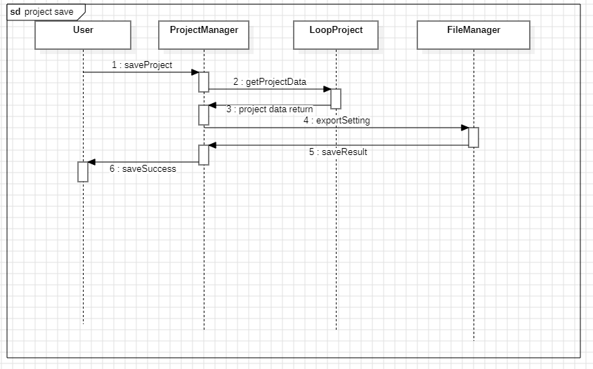
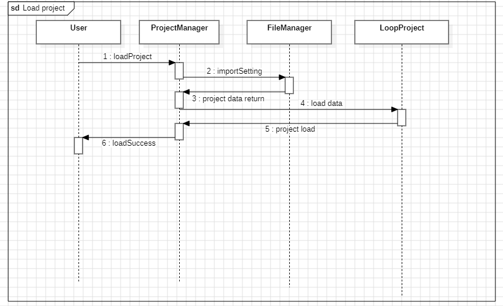

# Sequencediagram

이 그림은 회원가입 기능에 대한 Sequence Diagram이다. 사용자는 시스템을 이용하기 위해 회원가입 정보를 입력하고, 해당 정보는 시스템을 통해 데이터베이스에 저장된다.

사용자가 회원가입을 진행하면 User Interface는 입력된 회원 정보를 전달받아 User Class의 register() 메소드를 호출한다. 이 과정에서 시스템은 사용자의 회원가입 요청을 처리하기 위한 내부 로직을 수행한다.

User Class는 전달받은 회원 정보를 기반으로 Database에 saveUser() 요청을 수행하여 사용자 정보를 저장한다. 데이터베이스는 저장 작업이 정상적으로 완료되면 성공 결과를 반환한다.

User Class는 데이터베이스로부터 받은 저장 성공 응답을 User Interface에 전달하며, 최종적으로 시스템은 사용자에게 회원가입이 정상적으로 완료되었음을 알린다.

이 과정을 통해 사용자는 시스템에 새로운 계정을 생성하고 이후 로그인 및 주요 기능을 사용할 수 있게 된다.

이그림은 로그인 기능에 대한 Sequence Diagram이다. 사용자는 아이디와 비밀번호를 입력하여 로그인 요청을 보낸다. 시스템은 데이터베이스를 통해 사용자 정보를 검증하며, 검증 결과에 따라 로그인 성공 또는 실패를 결정한다. 로그인에 성공하면 메인 페이지를 표시하고, 실패하면 오류 메시지를 출력한다.

이그림는 루프 생성 기능에 대한 Sequence Diagram이다. 사용자는 마이크를 통해 녹음을 시작하고 종료하여 새로운 오디오 데이터를 생성한다. Recorder 클래스는 사용자의 마이크 입력을 받아 실시간으로 음성을 기록하며, 녹음이 종료되면 해당 데이터를 기반으로 Track 객체를 생성한다.

생성된 Track은 현재 작업 중인 LoopProject에 추가되며, 이를 통해 하나의 루프가 구성된다. LoopProject는 추가된 트랙을 관리하고 전체 루프 구조를 유지하는 역할을 수행한다. 최종적으로 시스템은 루프 생성이 완료되었음을 사용자에게 전달한다.

이 과정을 통해 사용자는 별도의 복잡한 장비 없이도 간단한 녹음 기반 루프를 생성할 수 있다.

이 그림은 루프 재생 기능에 대한 Sequence Diagram이다. 사용자는 AudioPlayer를 통해 선택된 트랙을 재생하고, 시스템은 해당 오디오를 반복 재생하는 구조로 동작한다.

사용자가 재생 기능을 실행하면 AudioPlayer 클래스의 play() 메소드가 호출된다. 해당 메소드는 선택된 음원을 불러오기 위해 Track 객체의 loadTrack() 메소드를 호출한다.

Track 객체는 저장된 오디오 데이터를 AudioPlayer에게 반환하며, AudioPlayer는 전달받은 audio data를 기반으로 실제 재생을 수행한다.

이후 AudioPlayer는 재생된 트랙을 반복적으로 출력하기 위해 루프 재생 상태를 유지하며, 동일한 트랙을 지속적으로 재생한다. 마지막으로 시스템은 사용자에게 현재 트랙이 루프 상태로 재생되고 있음을 전달한다.

이 그림은 프로젝트 저장 기능에 대한 Sequence Diagram이다. 사용자는 현재 작업 중인 루프 프로젝트를 저장하기 위해 저장 기능을 실행한다.

사용자가 저장 기능을 요청하면 ProjectManager 클래스의 saveProject() 메소드가 호출되며, 시스템은 현재 프로젝트 데이터를 구성하기 위해 LoopProject 객체의 getProjectData() 메소드를 호출한다.

LoopProject는 현재 포함된 트랙 및 루프 구성 정보를 기반으로 프로젝트 데이터를 생성하여 ProjectManager에게 반환한다.

이후 ProjectManager는 반환받은 프로젝트 데이터를 저장하기 위해 FileManager 클래스의 exportSetting() 메소드를 호출한다. FileManager는 해당 데이터를 파일 형태로 저장하거나 외부 저장소에 기록하는 역할을 수행한다.

저장이 완료되면 FileManager는 저장 결과를 ProjectManager에게 반환하고, ProjectManager는 저장 성공 여부를 사용자에게 전달한다.

최종적으로 시스템은 사용자에게 프로젝트가 정상적으로 저장되었음을 알림으로써 저장 프로세스를 종료한다.

이 그림은 프로젝트 불러오기 기능에 대한 Sequence Diagram이다. 사용자는 기존에 저장된 루프 프로젝트를 불러오기 위해 로드 기능을 실행한다.

사용자가 프로젝트 불러오기 기능을 요청하면 ProjectManager 클래스의 loadProject() 메소드가 호출된다. 이후 ProjectManager는 저장된 프로젝트 데이터를 불러오기 위해 FileManager 클래스의 importSetting() 메소드를 호출한다.

FileManager는 저장소에 존재하는 프로젝트 파일을 읽어 해당 데이터를 ProjectManager에게 반환한다. 반환된 데이터는 프로젝트 구조 정보를 포함하고 있으며, 루프 구성 및 트랙 정보 등이 포함된다.

ProjectManager는 전달받은 프로젝트 데이터를 기반으로 LoopProject 객체의 loadData() 메소드를 호출하여 내부 프로젝트 상태를 복원한다.

로딩이 완료되면 LoopProject는 시스템에 프로젝트가 정상적으로 로드되었음을 알리며, 최종적으로 ProjectManager는 사용자에게 로드 성공 메시지를 전달한다.

이 과정을 통해 사용자는 기존에 저장된 프로젝트를 다시 불러와 이어서 작업할 수 있다.

