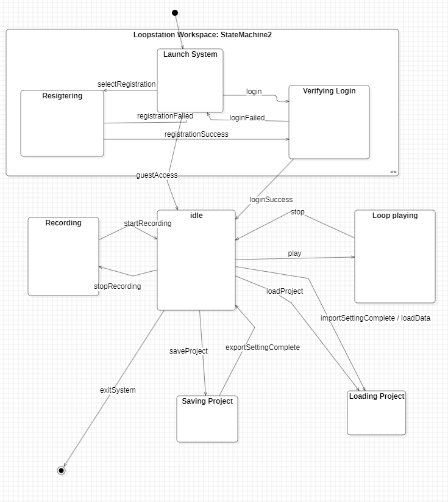

# State machine diagram

Status	Explanation
Launch System	시스템이 실행되어 사용자가 첫 화면(진입 화면)에 위치한 상태이다. 비회원으로 기능을 체험할지, 로그인을 시도할지 결정하는 대기 상태를 말한다.

Registering	사용자가 시스템을 이용하기 위해 회원가입 버튼(selectRegistration())을 눌러 정보를 입력하는 상태이다. 사용자의 입력 데이터를 임시로 받아 내부 로직 처리를 준비한다.

Verifying Login	사용자가 로그인하기 위해 아이디와 패스워드를 입력하여 검증(login(id, password))하는 상태이다. 데이터베이스와의 대조 결과(loginSuccess 또는 loginFailed)를 기다린다.

Idle	시스템 내부(메인 화면)에 성공적으로 진입한 기본 대기 상태이다. 루프스테이션의 모든 핵심 기능(녹음, 재생, 파일 관리)이 시작되는 중심점 역할을 한다. 비회원(Guest)과 회원(User) 권한에 따라 접근할 수 있는 기능 조건이 나뉜다.

Recording	사용자가 녹음 버튼을 눌러 마이크 입력 권한을 활성화하고 실시간으로 오디오 데이터를 기록하는 상태이다. Recorder 클래스가 동작하며, 종료 버튼(stopRecording())을 누르면 이 상태가 끝난다.

Processing Audio	녹음이 종료된 후, 기록된 실시간 음성 데이터를 기반으로 새로운 Track 객체를 생성하고 현재 작업 중인 프로젝트(LoopProject)에 자동으로 추가하는 처리 상태이다. 연산이 완료되면 다시 Idle 상태로 돌아간다.

Loop Playing	사용자가 재생 버튼(play())을 눌러 선택한 트랙의 음원을 AudioPlayer에 로드하고, 설정된 BPM 템포에 맞추어 동기화된 오디오 사운드를 무한 반복 재생하고 있는 상태이다. 정지 버튼(stop())을 누르기 전까지 이 상태를 유지한다.

Saving Project	사용자가 현재 작업 환경을 저장하기 위해 저장 기능을 요청한 상태이다. LoopProject로부터 현재 트랙 구조 및 효과 정보를 수집(getProjectData())하여 FileManager를 통해 파일이나 저장소로 내보내는 동안 머무르는 상태를 말한다. (회원 전용 상태)

Loading Project	사용자가 기존에 저장된 루프 데이터를 이어 작업하기 위해 프로젝트 로드 기능을 실행한 상태이다. FileManager의 importSetting() 메소드를 호출하여 파일 데이터를 읽어오고, 시스템 내부 상태를 이전으로 복원하는 대기 상태이다. (회원 전용 상태)