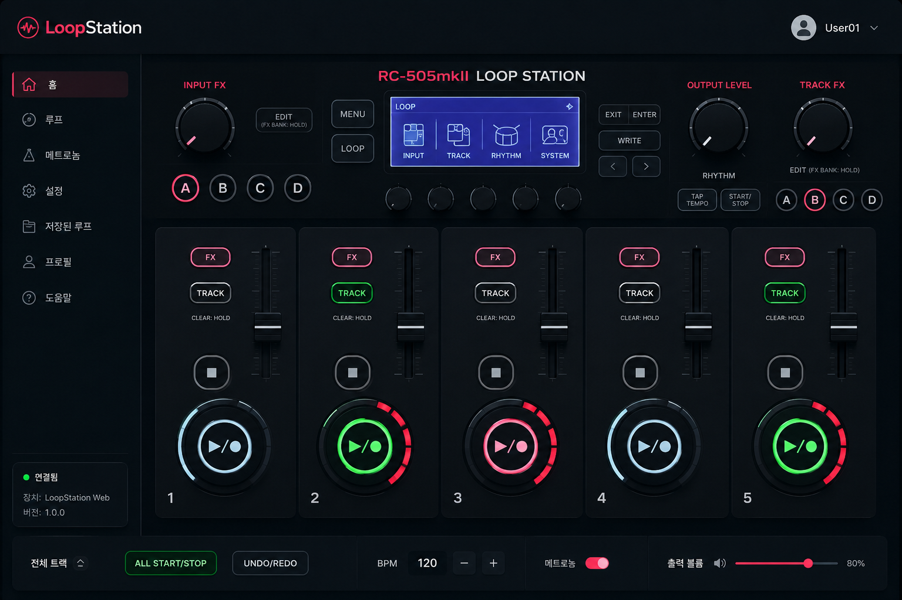
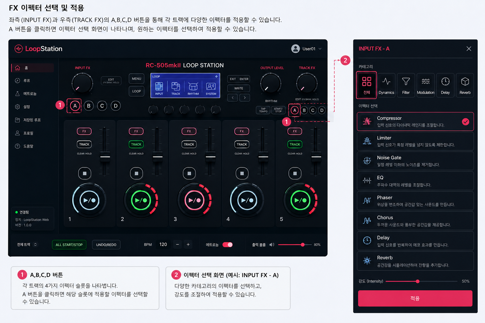
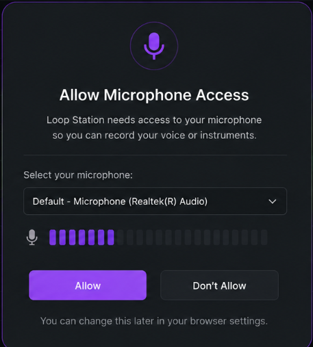
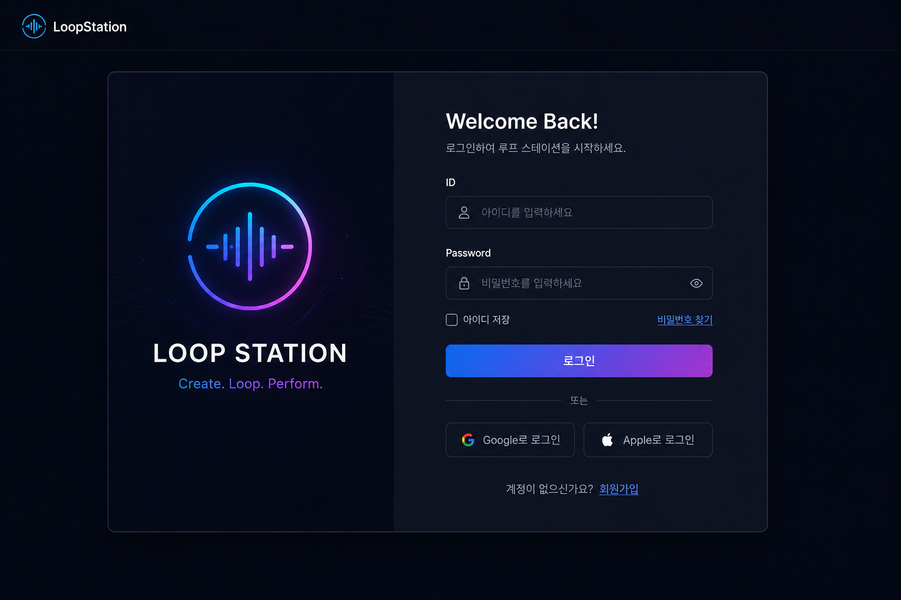
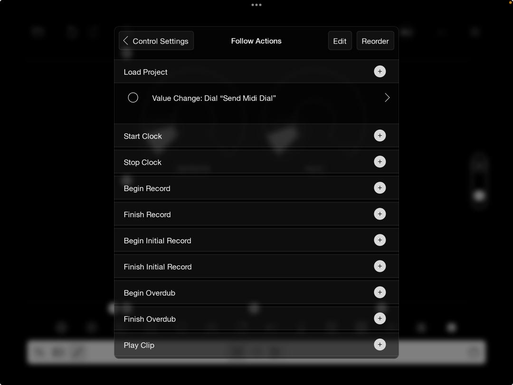

User Interface prototype

4.1.1 Loop Station Main Screen

아래 그림은 웹 기반 루프스테이션 시스템의 메인 화면이다. 사용자는 웹 브라우저를 통해 시스템에 접속한 뒤 루프 생성 및 음악 제작 기능을 사용할 수 있다. 시스템 중앙에는 현재 루프 상태와 BPM 정보를 확인할 수 있는 디스플레이 영역이 존재하며, 사용자는 이를 통해 현재 시스템 상태를 확인할 수 있다.
4.1.2 Track Control Interface

각 트랙은 독립적으로 녹음, 재생, 정지 기능을 수행할 수 있다.
루프를 녹음 중인 경우 빨간색 LED가 활성화되며, 재생 중인 경우 녹색 LED가 활성화된다.

또한 정지 버튼을 길게 누르면 현재 저장된 루프 데이터를 삭제할 수 있다.

4.1.3 FX Setting Interface

사용자는 좌측 INPUT FX 및 우측 TRACK FX 영역의 A,B,C,D 버튼을 통해 다양한 이펙터를 적용할 수 있다.
각 버튼에는 서로 다른 이펙트를 저장할 수 있으며, 사용자는 원하는 이펙트를 선택하여 슬롯에 등록할 수 있다.

4.1.4 Microphone Permission Interface

웹 기반 루프 스테이션은 오디오 녹음을 위해 브라우저의 마이크 접근 권한이 필요하다.
프로그램 최초 실행 시 사용자는 마이크 접근 허용 여부를 선택할 수 있으며, 권한이 허용되면 실시간 오디오 녹음 기능을 사용할 수 있다.

4.1.5 Login Screen

사용자는 루프 저장 기능 및 기존 프로젝트 관리를 위해 로그인 기능을 사용할 수 있다. 사용자는 ID와 Password를 입력하여 로그인할 수 있으며, 회원가입 버튼을 통해 새로운 계정을 생성할 수 있다.

로그인이 완료되면 사용자는 자신의 루프 프로젝트를 저장하거나 불러오는 기능을 사용할 수 있다.

4.1.3 Save Project Screen

사용자는 현재 제작 중인 루프 프로젝트를 저장할 수 있다. 저장 화면에서는 프로젝트 이름을 입력할 수 있으며, 저장 완료 후에는 사용자 계정에 해당 프로젝트가 기록된다.

또한 저장된 프로젝트 목록을 통해 이전에 제작한 루프를 다시 불러와 수정할 수 있다.

